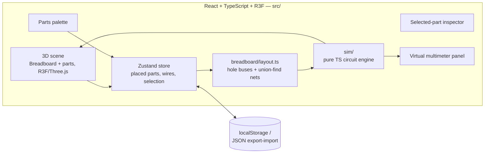

# Design Doc

## 1. Problem

Learning electronics/robotics hands-on requires owning parts — a breadboard,
a drawer of resistors and sensors, a handful of microcontrollers, motors,
drivers. That's a real barrier, and even with the parts in hand, it's easy
to wire something wrong (reversed polarity, no current-limiting resistor,
a short) and not understand *why* it didn't work.

**Goal:** a 3D, in-browser electronics workbench — drag real parts onto an
infinite canvas, wire them together hole-by-hole on a breadboard exactly
like the real thing, and see the circuit actually work: current flowing,
voltages you can probe with a virtual multimeter, LEDs lighting up (or not,
with a reason why). Not a SPICE-accurate EDA tool — a teaching tool that
generalizes the Ohm's-law-level formulas from
[`robotic-references/hello-electronics`](https://github.com/solomonxie/robotic-references/tree/master/hello-electronics)
into something live and visual.

## 2. Core concepts

| Concept | What it is |
|---|---|
| **Catalog** | Fixed, data-driven (`src/catalog/catalog.json`) list of concrete parts. Each entry's `type` selects both its procedural 3D geometry generator and its simulation behavior module; `name` is the specific instance with its own specs. Growing the catalog is adding an entry, not writing code. |
| **Breadboard** | A procedurally generated hole grid (`src/breadboard/layout.ts`) whose internal bus connectivity (power rails, 5-hole terminal strips) is modeled as data, resolved via union-find alongside placed parts and wires. |
| **Circuit graph** | The electrical structure of a design: nets (electrically-joined groups of holes/pins/wire endpoints) and components sitting across them. |
| **Simulation engine** | `src/sim/` — pure TypeScript, no rendering dependency. Nodal analysis with voltage-source stamping for the resistive network, plus small logic-level formula modules (H-bridge truth table, PWM average, thermistor Beta equation, ...) ported directly from `hello-electronics/*.py`. |
| **Sim result** | Node voltages + branch currents from the last solve. Drives both the current-flow visualization (particles along wires) and the virtual multimeter tool. Nothing else writes to it. |

## 3. Architecture

Pure static client app — no backend. All logic (3D scene, catalog, circuit
engine) runs in the browser; a design saves as a JSON file (export/import)
or to `localStorage`, the same git-friendly-file philosophy as
`distributed-debug`, just without needing a sync API since there's no
multi-device/sharing requirement yet.

`sim/` never imports React or Three — it's independently testable
(`npm run test`) and traceable 1:1 to the `hello-electronics` formulas it
generalizes.

### Rendering — procedural geometry only

No hand-modeled/imported 3D assets. A handful of reusable generator
families cover the whole curated catalog:

- **Axial passive** (cylinder + colored bands) → resistor, diode.
- **Radial cap**, **dome+leads** (LED) — one generator each.
- **PCB module** (box + instanced pin-header pegs from each entry's
  `pins[]` array) → ESP32, L298N, HC-SR04, DHT11, etc. A new sensor board
  is a new catalog entry + pinout array, not new geometry code.
- **Breadboard**: `<Instances>` for the ~830 holes (never per-hole meshes,
  never CSG-subtracted holes) — also gives cheap per-hole raycast picking
  via `event.instanceId`, which hole-precision wiring depends on.
- Known deferred weak spot: mecanum wheel rollers are genuinely hard
  procedurally; approximate with a torus + stripe texture until a single
  hand-authored GLTF exception is worth adding (post-M3, not before).

### Simulation — nodal analysis with voltage-source stamping

Right-sized subset of circuit theory, not full MNA/SPICE:

1. Conductance-matrix stamping over unknown nets (`1/R` per resistor,
   textbook pattern).
2. Ideal voltage sources (battery, GPIO HIGH/LOW, PWM-as-average) fix a
   net's voltage by substitution rather than adding branch-current
   unknowns — valid since the catalog has no floating/differential
   sources. Solved with plain Gauss elimination (net counts are small).
3. LEDs/diodes: piecewise-linear clamp (solve open, clamp to `Vf` if
   exceeded, re-solve 2-3 times).
4. Capacitors: not folded into the steady-state solve — drive a
   charge/discharge animation value from the RC time-constant formula
   instead of a real transient solve.
5. L298N/H-bridge: truth-table module computes the driven output voltage
   before handing off to the resistive solver.
6. Sensors: small formula modules taking a user-settable "simulated
   stimulus" (temperature slider, distance slider, ...).

### Breadboard connectivity — union-find over three sources

`netKeyOf(hole)` maps a hole to its bus (rail vs. 5-hole strip half). Net
resolution unions (a) every hole's bus key, (b) every placed part's
pin-in-hole, (c) every wire's endpoints.

**Documented simplification**: each power rail is modeled as one
continuous net — real breadboards sometimes split rails at the midboard
gap. Close enough for a teaching tool; revisit only if it actually
confuses a lesson.

## 4. Roadmap

- **M0** (done) — Scaffold: R3F canvas, instanced-hole breadboard, one
  draggable resistor with color bands computed from its `ohms` value,
  10-entry seed catalog, `sim/` formula ports + tests, deployed to GitHub
  Pages.
- **M1** — HTML parts palette; drag-from-palette-to-canvas; expand catalog
  to ~20-25 curated parts from `robotic-references` (ESP32, L298N,
  HC-SR04, DHT11, thermistor, MQ-2, KY-038, PIR, IR obstacle, passives,
  TT motor, mecanum wheel, 18650 cell, UBEC).
- **M2** — Wire tool (hole/pin → hole/pin); union-find net resolution
  wired up; undo/redo; JSON export/import + localStorage autosave;
  inspector panel.
- **M3** — `sim/solver.ts` + `sim/digital.ts` live; current-flow
  visualization; virtual multimeter. Done bar: one small end-to-end
  circuit (e.g. ESP32 GPIO → resistor → LED, or a thermistor
  voltage-divider readout) — not the full robo-car assembly.
- **M4+ (stretch)** — Atomic-level cutaway illustrations (one per part
  category, stylized — not physically simulated atoms); soldering tool +
  iron animation + permanent vs. breadboard-removable joints; hand-authored
  mecanum-roller GLTF; a curated full robo-car demo once the pipeline is
  proven on something small.

**Explicitly, permanently out of scope**: an MCU/firmware emulator running
actual Arduino/MicroPython code. "Digital behavior" means setting a GPIO's
state/PWM duty in an inspector panel. Also out of scope: live USB/WebSerial
connection to real hardware — "debugging your device" here means visual
comparison (current-flow + multimeter readouts) against your physical
build, not a live telemetry link.

## 5. Deployment

GitHub Pages via `actions/upload-pages-artifact` + `actions/deploy-pages`.
No backend, no EC2/Terraform/Ansible (unlike `distributed-debug`, which
needs a box for its sync API) — this is a pure static SPA.
`vite.config.ts` sets `base: '/robo-sims/'` for project-pages routing.
