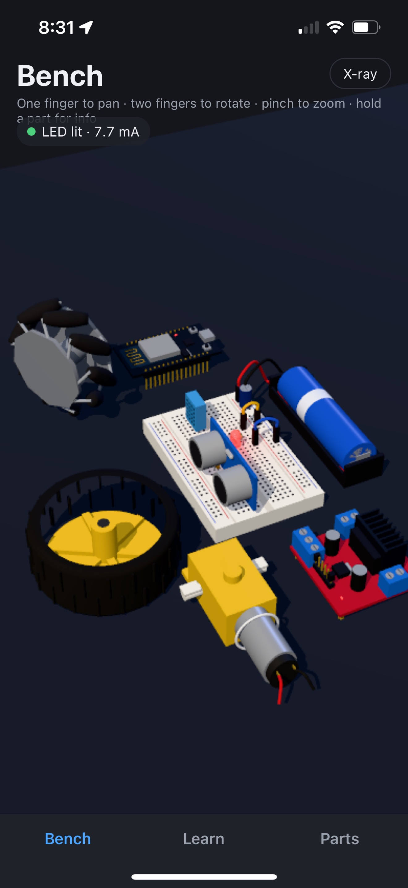
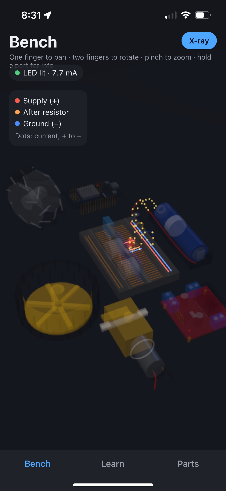
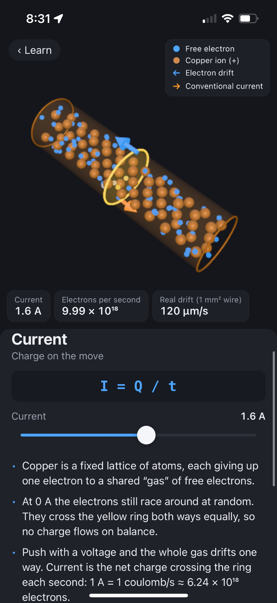
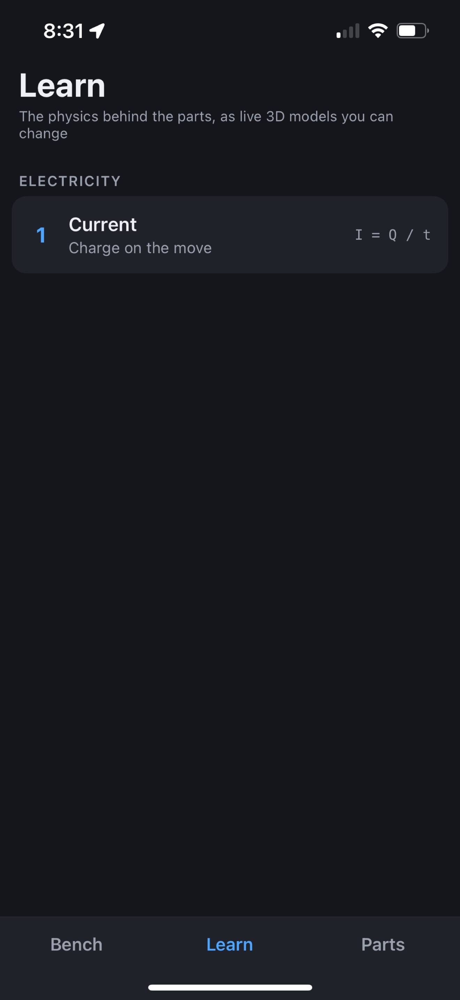
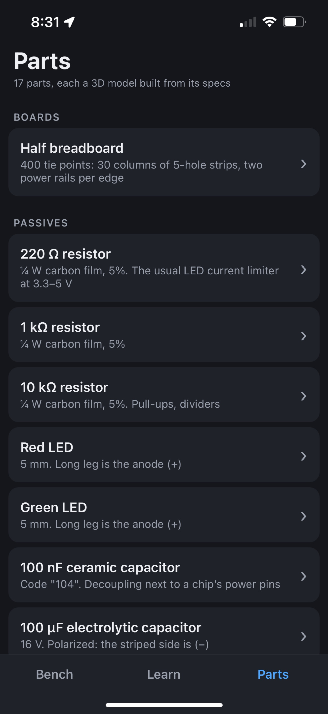
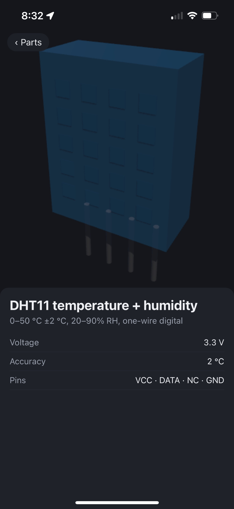

# Robo Sims

iPhone app for learning electronics and robotics hands-on, without owning the parts. You get a 3D workbench with real components you can orbit and inspect, and circuits that actually work. For example, an 18650 lights an LED through a resistor, and swapping the resistor dims or brightens it. A Learn tab explains the physics underneath as interactive 3D illustrations, starting with current.

React Native + TypeScript, no Expo. 3D is Three.js on WebGPU (Metal) via `react-native-webgpu`. Every part is a procedural model built from its catalog specs.

## Quick start

```sh
make install                  # npm + pods
cp app/ios/Local.xcconfig.example app/ios/Local.xcconfig   # your Team ID
echo 'DEVICE = <udid>' > Local.mk                          # xcrun devicectl list devices
make ios-build ios-run        # Release build, JS embedded, onto the iPhone
make test typecheck lint
```

There's no dev server. The app always loads the `main.jsbundle` embedded at build time, so reinstall to see a change.

See [DESIGN.md](DESIGN.md) for the architecture and roadmap.

## Screenshots

| Bench | X-ray current view | Lesson: Current |
| --- | --- | --- |
|  |  |  |

| Learn | Parts | Part viewer |
| --- | --- | --- |
|  |  |  |

## License

MIT, see [LICENSE](LICENSE).
